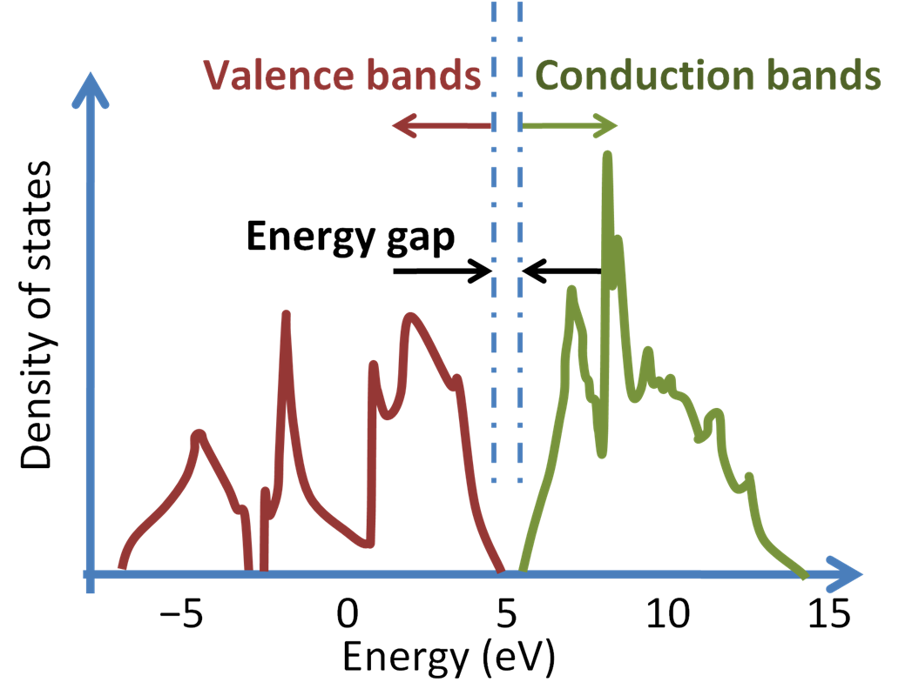

# Density of state (DOS)

## Introduction
* Density of States (DOS) represents the number of available electronic states at some energy.
* It is a fundamental concept in solid-state physics and materials science, providing crucial information about the electronic structure and properties of materials.

## Physical meaning of DOS
### Fundamental concept
* DOS represents the number of states available for electron occupation at energy $E$.
* Higher DOS indicates more states available for electron occupation, which is often useful for electronic conduction, making/breaking chemical bonds, magnetization etc.
* The energy region with (1) non-zero DOS, (2) below the Fermi energy is called the *valence band*, and the region with (1) non-zero DOS, (2) above the Fermi energy is called the *conduction band*. The zero-DOS region between the valence and conduction bands are called the *band gap*.

<div align=center>

</div>

### Mathematical Definition
* Formal definition:
  $$
  DOS(E) = \sum_i^k \delta(E - \varepsilon_{i,k})
  $$
  where:
  - $\varepsilon_{i,k}$: the energy eigenvalues
  - $i$ runs over bands
  - $k$ runs over k-points in the Brillouin zone
  - $\delta$ is the Dirac delta function
* In practice, $\delta$ function is replaced by a finite energy range ($\Delta E$), so the DOS means the number of electronic state within this energy gap.

### Integration Properties
* Number of electrons:
$$
N = \int^{E_F} DOS(E)dE
$$
* Total energy:
$$
E = \int^{E_F} E \cdot DOS(E)dE
$$
* $E_F$ is the Fermi energy.

## Practical DOS Calculations
### Detailed Calculation Steps
* Usually, the geometry optimization is done before the DOS calculation.
* If the `LDOS` tag is set to `.TRUE.`, the DOS calculation is done at the last step of geometry optimization. So separate single-point calculation at the optimized geometry is usally not necessary.
* If you want to do DOS calculation at higher k-point mesh or higher cutoff energy, you can take the separate calculation.

### INCAR
* No specifical tag is necessary to output the total DOS, but `LORBIT` need to be set when PDOS is needed (mentioned later).
* Note that the correct DOS cannot be obtained unless the number of k-points is sufficiently large.
* The smearing parameters in the `INCAR` (ISMEAR, SIGMA) also affect the accuracy of the DOS.

1. Structure Optimization:
```
IBRION = 2    # Ion relaxation
NSW = 100     # Number of ionic steps
```

2. DOS Calculation:
```
IBRION = 0
NSW    = 0
LDOS   = .TRUE.  # actually this is default
```

## After VASP calculation
* A file called `DOSCAR` will be output.
* Be aware that the output differs between spin-polarized and non-polarized calculations.
* For non-polarized calculations, the meaning of each column in `DOSCAR` is as follows:
    `energy    DOS    integrated-DOS`

## Making plottable DOS file
* `DOSCAR` has many sections, so it is not easy to make plot from it.
* It is useful to use `vaspkit` for this purpose.

### Installing vaspkit
1. Go to vaspkit website: https://vaspkit.com/index.html
2. Go to the "latest release page" (in SourceForge).
3. Find the latest tar.gz file for Linux, and get the URL.
4. Go to your VASP-installed-computer (supercomputer).
5. Download the tar.gz file by using `wget` (`wget URL`).
6. Extract with `tar zxvf vaspkit-xxx.tar.gz`.
7. `cd vaspkit.x.x.x`
8. `source setup.sh`
9. `source ~/.bashrc`

### Using vaspkit
* vaspkit is quite easy to use. Just type `vaspkit` in terminal, and follow the instruction.
* Total DOS
  + To generate the DOS-related functions, type `11`.
  + To get the total DOS, type `111`.
  + Total DOS file `TDOS.dat` is generated. The energy position is shifted so as the Fermi energy becomes 0.

## Plotting the DOS
* Copy `*.dat` file generated from vaspkit. Now it is easy to make plot.
* Any software (Excel, Gnuplot, etc) is OK.
* When using gnuplot, the command becomes like 
```bash
gnuplot
> plot "TDOS.dat" using 1:2 with lines
> plot "TDOS.dat" using 1:2 with lines, "TDOS.dat" using 1:3 with lines # when spin-polarized case
```

## Projected DOS (PDOS)
* The PDOS refers to the DOS decomposed by angular momentum (s, p, d, etc.).
* To get the PDOS, use `LORBIT` tag in `INCAR`.
    + `LORBIT = 10`: makes s-, p-, d-decomposed DOSs.
    + `LORBIT = 11`: makes s-, px-, py-, pz-, dxy- ... DOSs.
* Plotting procedure is same with the total DOS.
* If you want to take the information of the d-band (to calculate the d-band center, for example), you should use PDOS.

## Localized DOS (LDOS)
* LDOS refers to the DOS calculated separately for each atom.
* LDOS can be obtained from `vaspkit`.
* If you want to focus on the oxygen atom 2p band (often denoted as $\rm {O}_{2p}$ band), both localization and projection is needed.

